<p align="center">
  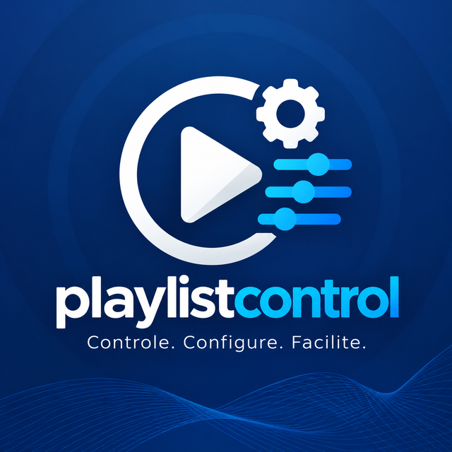
</p>

<h1 align="center">Playlist Control</h1>

<p align="center">
  Aplicativo Windows open source feito em <b>JUCE</b> que centraliza a configuração e a operação do <b>Playlist Digital</b>:<br>
  mapas, grades, relógios, <code>PLAYLIST.ini</code>, opções, pastas, índices e diagnóstico — com gravação segura e histórico.
</p>

<p align="center">
  
  
  
  
  
</p>

<p align="center">
  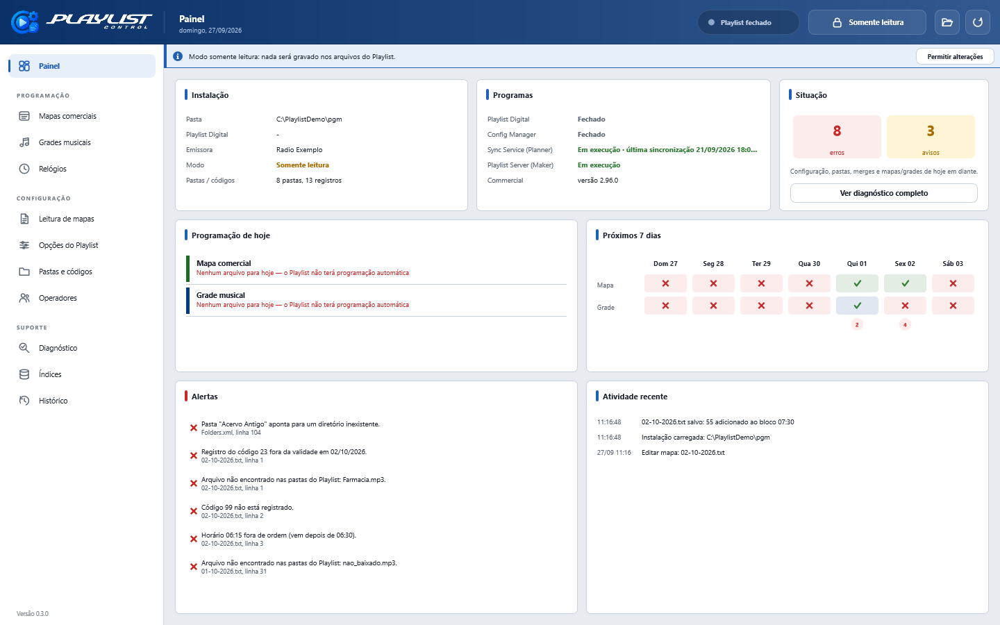
</p>

---

## O que é o Playlist Control

O **Playlist Control** é um único executável nativo para Windows (C++20 + JUCE + APIs nativas do
Windows) que lê, mostra, valida e altera os arquivos que o **Playlist Digital** usa na pasta
`C:\Playlist\pgm`. O operador trabalha com blocos, horários, códigos e opções — não com arquivos
de texto, XML ou DBF.

Ele entende de onde vem cada arquivo: mapas entregues pelo **Planner** (via Sync Service),
exportados pelo **Commercial**, grades gravadas pelo **Maker** (Playlist Server), a programação
eleitoral mesclada pelo Playlist (`.merge`) ou arquivos mantidos à mão. Antes de qualquer alteração, avisa quando o
arquivo será regravado automaticamente por outro programa.

Toda gravação é validada, guarda a versão anterior e substitui o arquivo de forma atômica. O
programa começa em **modo somente leitura**.

## O problema que resolve

O Playlist Digital é configurado por muitos arquivos e ferramentas diferentes: mapas e grades em
texto, o `PLAYLIST.ini` editado no bloco de notas, o `CONFIG.XML` da tela de opções, as pastas do
Config Manager, os códigos do Registrar e o que Planner, Commercial e Maker geram. Um erro de
digitação em um mapa, um código fora da validade, uma pasta renomeada ou um mapa que não foi
gerado para o dia só aparecem **no ar**, como um X vermelho ou um bloco vazio.

O Playlist Control junta tudo isso em uma janela, mostra o que o Playlist vai fazer — qual arquivo
ele lê em cada dia, o que cada código toca, o que está faltando — e explica cada problema com o
motivo e a correção.

## Principais funcionalidades

- **Mapas, grades e relógios** desenhados como no painel de programação do Playlist, com a faixa
  Comercial/Musical, os parâmetros do bloco e o que cada item toca de fato.
- **Resolução de códigos** contra as pastas do Config Manager e os registros do `LIGACAO.DBF`,
  com validade por data e rodízio. Itens que não vão ao ar aparecem com X vermelho e o motivo.
- **Edição** de blocos (horário, ID, DUR, FIXO, SAT, LOCAL, bloqueado, descarte) e itens (código,
  arquivo, `CÓDIGO|arquivo`, comando); criação de arquivos novos.
- **Origem e ciclo de vida** de cada arquivo (Planner, Commercial, Maker, Horário Eleitoral,
  manual), confirmada pela configuração dos próprios programas quando possível.
- **Leitura de mapas (`PLAYLIST.ini`)** com prévia dos próximos 7 dias: qual arquivo o Playlist
  procura e se ele existe. **Afiliadas de rede** (`[AFILIADAS]`) em tabela: nome, IP e porta.
- **Opções do Playlist (`CONFIG.XML`)** agrupadas como em Ferramentas > Opções, com a explicação
  do manual; edição liberada só com o Playlist fechado.
- **Pastas e códigos**, **operadores** e permissões (consulta).
- **Diagnóstico** de toda a instalação, inclusive dos índices `Indices\*.NTX` comparados com as
  tabelas.
- **Recriação dos índices** guiada: fecha o Playlist pela janela, copia e apaga os índices, executa
  o SeparaComprove, reabre o Playlist e confere o resultado.
- **Histórico** com a diferença linha a linha e restauração de qualquer versão.
- **Alterações externas** detectadas: arquivo recarregado ou conflito mostrado, nunca
  sobrescrito em silêncio.
- **Gravação sem perda**: codificação, quebras de linha, comentários, ordem e campos
  desconhecidos preservados.

## Interface

A identidade visual segue o Playlist Digital: cabeçalho azul, blocos comerciais em verde e
musicais em azul (cores do modelo de aparência *Standard* do próprio Playlist), X vermelho para
itens que não tocam. No cabeçalho, a situação do Playlist (**no ar** / **fechado**), o modo
(**somente leitura** / **edição liberada**) e os botões de instalação e recarregar; à esquerda, o
menu por grupos — Programação, Configuração e Suporte.

### Painel

<p>
  
</p>

| Área | O que mostra |
|---|---|
| **Instalação** | Pasta, versão do Playlist Digital, emissora, modo (somente leitura / alterações permitidas), pastas e códigos. |
| **Programas** | Playlist Digital e Config Manager abertos ou fechados; estado do Sync Service (com a última sincronização) e do Playlist Server; Commercial e para onde ele exporta. |
| **Situação** | Erros e avisos de toda a instalação. |
| **Programação de hoje** | O mapa, a grade e os relógios que o Playlist lê hoje, com origem e problemas. Clique para abrir. |
| **Próximos 7 dias** | Se existe mapa e grade para cada dia. |
| **Alertas** e **Atividade recente** | Os problemas mais graves e o que mudou nesta sessão — inclusive alterações feitas por outros programas. |

### Mapas, grades e relógios

<p>
  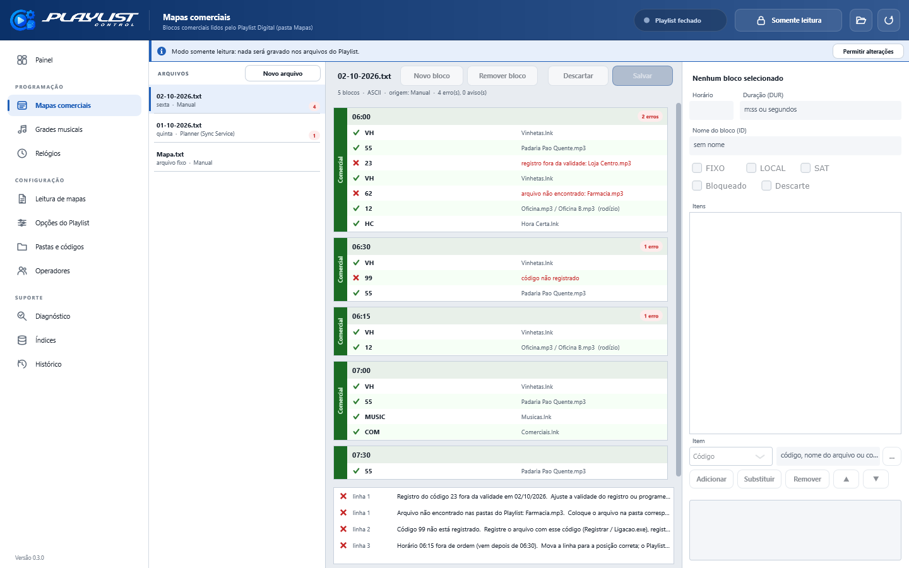
</p>

| Área | O que faz |
|---|---|
| **Arquivos** | Todos os arquivos da pasta, com o dia da semana, a origem, o selo **HOJE** no arquivo que o Playlist lê hoje e a quantidade de erros. **Novo arquivo** cria um arquivo vazio, com os horários de outro ou copiado. |
| **Blocos** | Cada bloco com horário, parâmetros (ID, DUR, F, SAT, LOCAL, BLOQUEADO, DESCARTE) e itens. Cada item mostra o que toca e onde o arquivo está, ou por que não vai ao ar. |
| **Inspetor** | Edita o bloco selecionado: horário, nome, duração, parâmetros e itens (adicionar, substituir, remover, reordenar). O botão **…** lista pastas e códigos registrados. |
| **Faixa de origem** | Avisa, por exemplo, que o Sync Service regrava o mapa a cada 5 minutos e que a alteração deve ser feita no Planner. |
| **Problemas** | Os problemas do arquivo; clique para ir ao bloco. |

<p>
  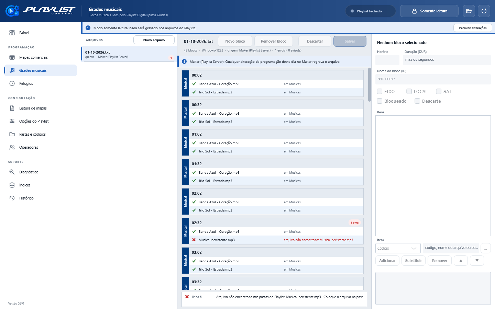
  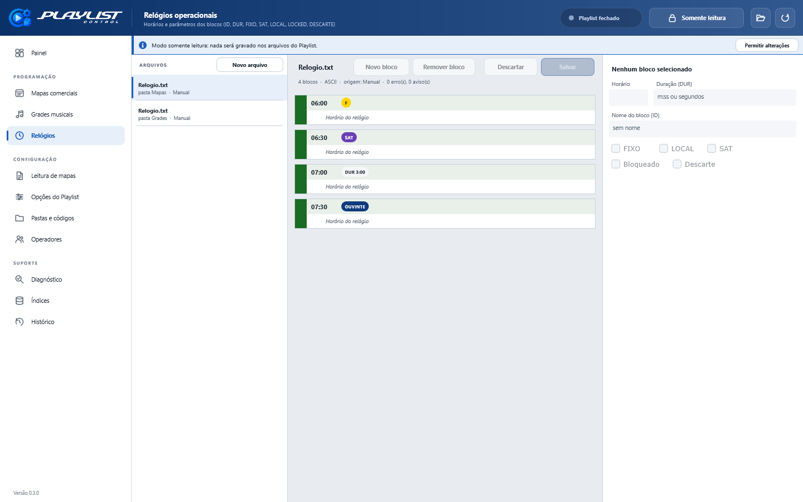
</p>

### Leitura de mapas e opções do Playlist

<p>
  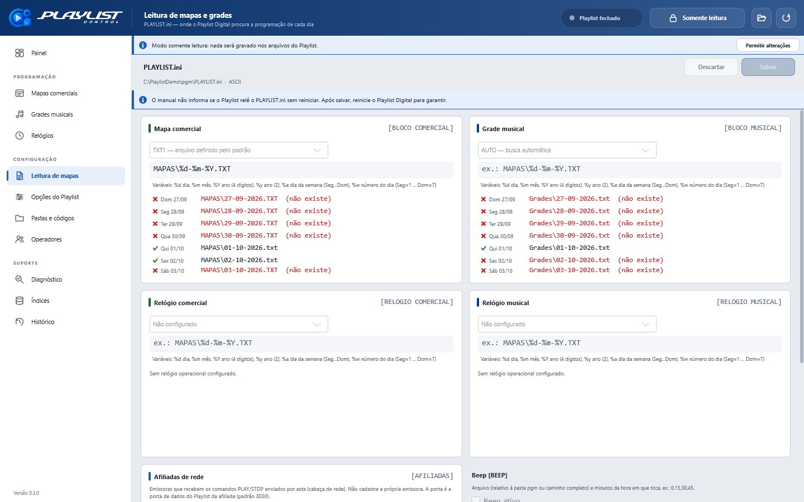
  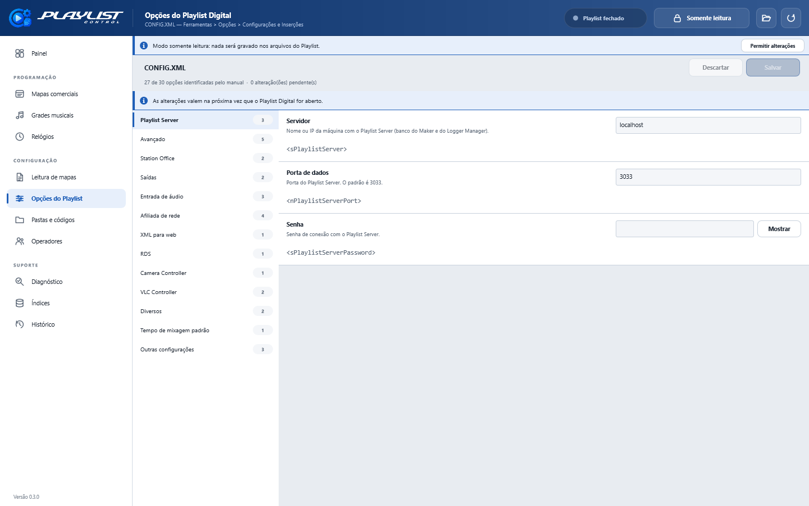
</p>

- **Leitura de mapas**: para cada fonte ([BLOCO COMERCIAL], [BLOCO MUSICAL], [RELOGIO ...]), o
  formato AUTO ou TXT1, o padrão de arquivo (`%d %m %Y %y %a %w`) e a prévia dos próximos 7 dias.
  **Afiliadas de rede**: as emissoras que recebem os comandos PLAY/STOP desta (cabeça de rede),
  com nome, IP ou máquina e porta de dados (padrão 3030); adicionar, remover e validar. Beep e as
  demais seções, que são mantidas como estão.
- **Opções do Playlist**: cada opção do `CONFIG.XML` com o nome da tela de opções, a explicação e o
  elemento XML. Opções cuja correspondência não é explícita no manual são marcadas como
  *correspondência provável*; senhas ficam ocultas; saídas de áudio são somente leitura.

### Pastas, operadores e suporte

<p>
  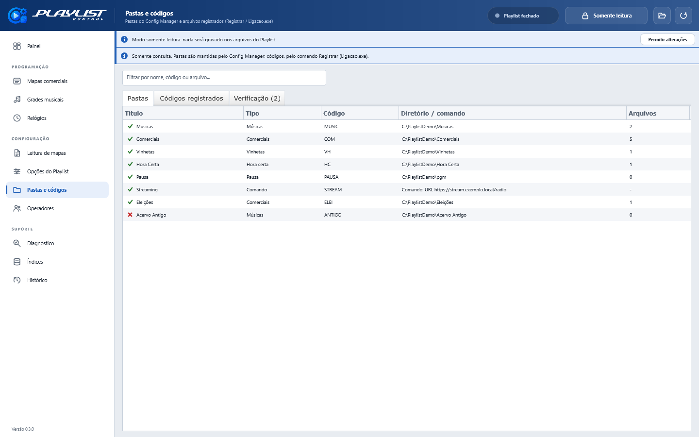
  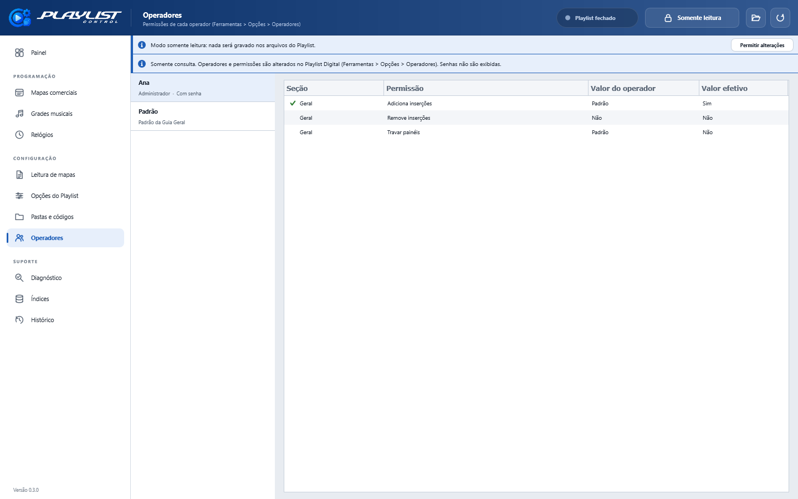
</p>
<p>
  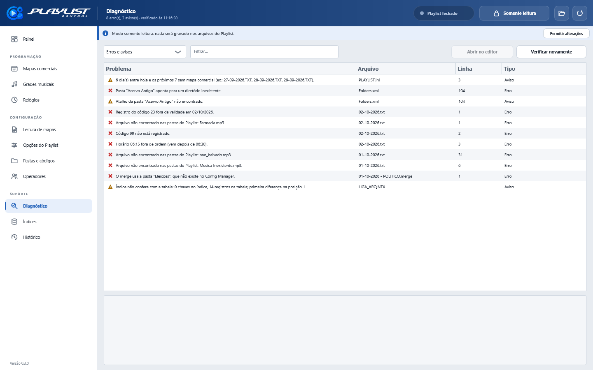
  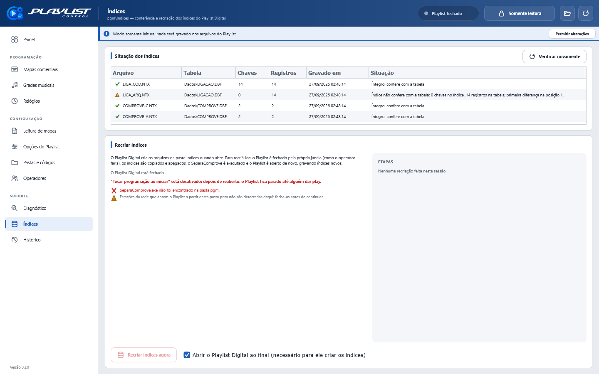
</p>
<p>
  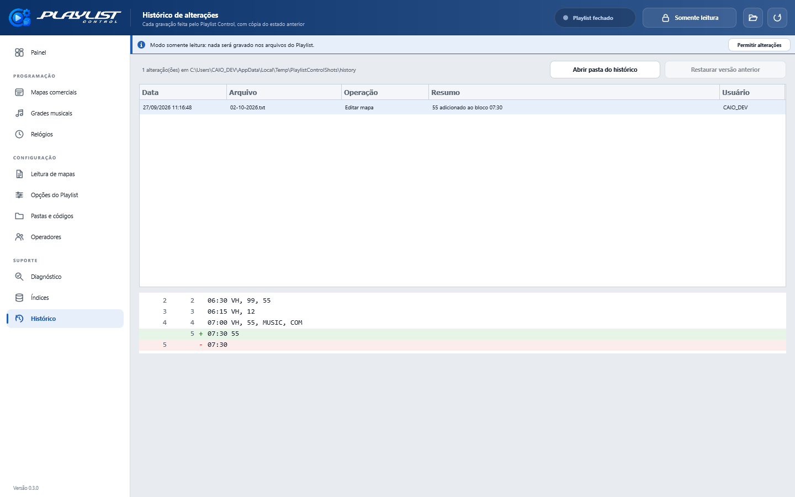
</p>

| Tela | O que faz |
|---|---|
| **Pastas e códigos** | Pastas do Config Manager (tipo, código, diretório, arquivos), comandos, códigos registrados com validade e onde cada arquivo foi encontrado. |
| **Operadores** | Permissões de cada operador e o valor efetivo quando a permissão segue o padrão da Guia Geral. |
| **Diagnóstico** | Todos os problemas, com filtro. Cada um diz o que está errado, onde, por que importa e como resolver; **Abrir no editor** leva ao bloco. |
| **Índices** | Cada `.NTX` comparado com a tabela (íntegro, não confere, ilegível). **Recriar índices agora** segue o procedimento do suporte, etapa por etapa, com cópia de segurança e aviso quando o Playlist não volta a tocar sozinho. Detalhes em [docs/INDICES.md](docs/INDICES.md). |
| **Histórico** | Cada gravação com data, arquivo, operação, resumo e usuário; diferença linha a linha; **Restaurar versão anterior**. |

As imagens usam a instalação fictícia de `tests/fixtures/installation`.

## Arquitetura

```
Playlist Control
├── core/         diagnósticos, codificação de texto sem perda, horários, diff de linhas
├── storage/      leitura com compartilhamento total, gravação segura, histórico
├── formats/      INI, TXT1 (mapas/grades/relógios), XML por patch, DBF, NTX, montagem/merge
├── ecosystem/    Commercial, Sync Service, Playlist Server, Maker; origem dos arquivos
├── install/      detecção e validação da instalação
├── catalog/      pastas + registros → resolução de códigos
├── validation/   verificações com causa e correção
├── services/     workspace, sessões de arquivo, observador de pasta, atividade
└── ui/           interface JUCE (tema, janela, telas)
```

O levantamento de formatos, origens e comportamento está em [ARCHITECTURE.md](ARCHITECTURE.md);
o plano e as pendências em [IMPLEMENTATION_PLAN.md](IMPLEMENTATION_PLAN.md); a análise dos índices
em [docs/INDICES.md](docs/INDICES.md).

### Gravação segura

```
edição → validação → comparação com o disco (conflito?) → cópia no Histórico
       → arquivo temporário na mesma pasta → descarga no disco → releitura
       → ReplaceFileW (substituição atômica) → releitura → histórico e log
```

O Playlist relê mapas e grades assim que eles mudam; a substituição atômica garante que ele veja o
arquivo antigo ou o novo, nunca um meio-termo. Os formatos são regravados sem perda: lendo e
regravando em memória os 201 mapas, grades e modelos, o `PLAYLIST.ini` e todos os XML de uma
instalação real, todos voltaram idênticos byte a byte.

### JUCE

| Onde | Classe JUCE |
|---|---|
| Aplicação e janela | `JUCEApplication`, `DocumentWindow` |
| Telas e tema | `Component`, `LookAndFeel_V4` (tema próprio), `Viewport`, `TabbedComponent` |
| Listas e tabelas | `ListBox`, `TableListBox` |
| Diálogos e menus | `AlertWindow::showAsync`, `MessageBoxOptions`, `PopupMenu`, `FileChooser` |
| Atualização da interface | `ChangeBroadcaster`, `Timer`, `MessageManager::callAsync` |
| Observador de pasta | `juce::Thread` |
| Configuração | `PropertiesFile` |
| Histórico e logs | `File`, `MemoryBlock`, `JSON`, `DynamicObject`, `FileOutputStream` |
| Integridade | `SHA256` |
| Recursos embutidos | `juce_add_binary_data`, `ImageCache` |
| Testes | `UnitTest`, `UnitTestRunner` |

### Windows

| Onde | API |
|---|---|
| Leitura de arquivos abertos pelo Playlist | `CreateFileW` com compartilhamento de leitura, escrita e exclusão |
| Gravação atômica | `FlushFileBuffers`, `ReplaceFileW`, `MoveFileExW` |
| Alterações externas | `ReadDirectoryChangesW` |
| Playlist, Config Manager, Commercial e Maker abertos | `CreateToolhelp32Snapshot`, `QueryFullProcessImageNameW` |
| Playlist Server e Sync Service | `EnumServicesStatusExW` |
| Programas instalados | registro `Uninstall` |
| Versão do Playlist | `GetFileVersionInfoW` |

## Por que JUCE?

A interface precisava ter a cara dos produtos Playlist — painel de blocos, faixas coloridas, X
vermelho — e não a de um formulário genérico. O JUCE desenha tudo com o mesmo motor gráfico,
com controle total sobre cada componente, e ainda oferece em uma única base de código as
peças que o resto do programa usa: arquivos, threads, JSON, hash, configuração e testes. As APIs
do Windows entram só onde são a forma correta de fazer algo (substituição atômica, observação de
pasta, processos e serviços).

## Instalação

Baixe o `PlaylistControl-0.3.0-win64.zip` em
[Releases](https://github.com/caio-kenai/PlaylistControl/releases), extraia e execute
`PlaylistControl.exe`. Não há instalador nem dependências (CRT estático). Confira os arquivos
com o `SHA256SUMS.txt` da release.

Na primeira execução o programa procura a instalação do Playlist Digital pelo registro do
Windows, pela configuração do Commercial e do Sync Service e por `X:\Playlist\pgm` em cada
unidade. A pasta só é aceita com o executável do Playlist e seus arquivos de configuração. Use
**Instalação** no topo para confirmar ou escolher outra pasta, e **Permitir alterações** para sair
do modo somente leitura.

Atalhos: `Ctrl+S` salva, `F5` recarrega, `Ctrl+1` a `Ctrl+9` abrem as nove primeiras telas do
menu.

## Arquivos do Playlist

| Arquivo | Leitura | Gravação |
|---|---|---|
| `Mapas\*.txt`, `Grades\*.txt`, relógios, modelos | sim | sim (o Playlist relê sozinho) |
| `PLAYLIST.ini` | sim | sim |
| `CONFIG.XML` | sim | sim, com o Playlist fechado |
| `Folders.xml`, `Atalhos\*.lnk` (Config Manager) | sim | não |
| `Dados\LIGACAO.DBF` (registros) | sim | não |
| `Operadores\*\Config.xml` | sim | não |
| `Indices\*.NTX` | sim (verificação) | recriação com o Playlist fechado (Suporte > Índices) |
| `Montagem\*.merge`, montagens | sim | não |

## Dados do Playlist Control

| O quê | Onde |
|---|---|
| Configurações | `%APPDATA%\PlaylistControl\PlaylistControl.settings` |
| Histórico (cópias de segurança) | `%LOCALAPPDATA%\PlaylistControl\history` |
| Cópias feitas antes de recriar os índices | `%LOCALAPPDATA%\PlaylistControl\indices` |
| Log (JSON por linha, um arquivo por dia) | `%LOCALAPPDATA%\PlaylistControl\logs` |

O log registra início e encerramento, arquivos carregados, gravações (com hash antes e depois),
validações recusadas, conflitos, alterações externas e restaurações. Não registra conteúdo de
arquivos nem senhas.

## Compilação

Requisitos: Windows 10/11, Visual Studio 2022 (ou Build Tools) com a carga de trabalho C++ — que
já traz CMake e Ninja — e Git.

```powershell
git clone --recursive https://github.com/caio-kenai/PlaylistControl.git
cd PlaylistControl

powershell -ExecutionPolicy Bypass -File scripts\build.ps1                 # Release + testes
powershell -ExecutionPolicy Bypass -File scripts\build.ps1 -Debug          # Debug
powershell -ExecutionPolicy Bypass -File scripts\build.ps1 -VisualStudio   # build-vs\PlaylistControl.sln
```

O CMake é a fonte da configuração; a solução do Visual Studio é gerada por ele. O JUCE 9.0.2 é um
submódulo em `external/JUCE`. `tools/make_fixtures.py` gera a instalação fictícia dos testes e
`tools/make_icon.py` o ícone.

## Testes

```powershell
build-release\bin\playlistcontrol_tests.exe
```

Cobrem leitura e regravação byte a byte de cada formato, edição, validação, gravação segura
(conflito, arquivo em uso, falha de verificação, somente leitura), histórico, catálogo, origem dos
arquivos e índices NTX.

Verificação somente leitura contra uma instalação real (nada é gravado):

```powershell
build-release\bin\playlistcontrol_tests.exe --category=installation --installation=C:\Playlist\pgm
```

Recriação dos índices de ponta a ponta, **somente numa cópia de demonstração** (fecha e abre
programas e apaga arquivos):

```powershell
build-release\bin\playlistcontrol_tests.exe --category=rebuild --rebuild-demo=C:\PlaylistDemo\pgm
```

## Solução de problemas

- **"Pasta não reconhecida"**: escolha a pasta `pgm`, com o `Playlist.exe` e ao menos um entre
  `PLAYLIST.ini`, `CONFIG.XML` e `Folders.xml`.
- **"O arquivo está em uso por outro programa"**: tente de novo em alguns segundos; nada foi
  alterado.
- **"O arquivo foi alterado por outro programa"**: recarregue e refaça a alteração; compare no
  Histórico se precisar.
- **Opções do Playlist bloqueadas**: feche o Playlist Digital.
- **Recriar índices bloqueado**: a tela Índices lista o motivo — Ligacao, Config Manager ou
  SeparaComprove abertos, ou um Playlist rodando como administrador (abra o Playlist Control como
  administrador ou feche o Playlist manualmente).
- **Muitos "arquivo não encontrado"**: confira no Config Manager se as pastas apontam para os
  diretórios certos; **Pastas e códigos** mostra onde cada arquivo foi encontrado.

## Limitações

- Pastas, registros e operadores são somente consulta.
- A recriação dos índices exige fechar o Playlist; não há forma segura de fazê-la com ele no ar
  ([docs/INDICES.md](docs/INDICES.md)).
- Pontos do formato ainda não confirmados estão em
  [IMPLEMENTATION_PLAN.md](IMPLEMENTATION_PLAN.md) e são tratados de forma conservadora.

## Licença

[GNU AGPL-3.0](LICENSE).
